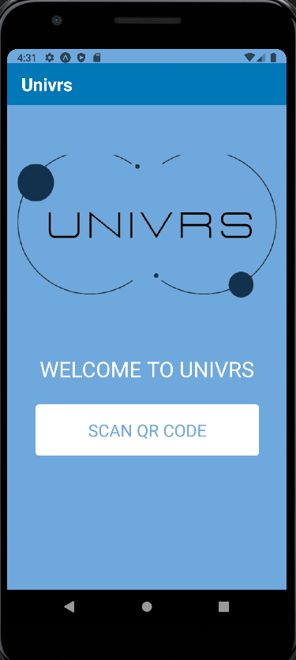
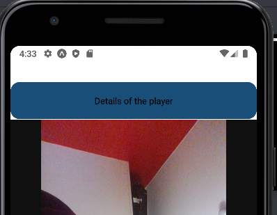
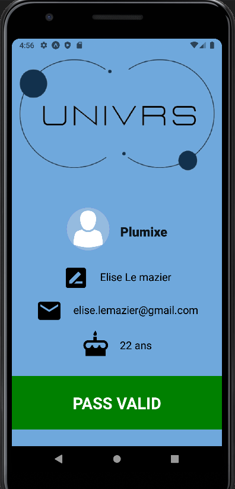

# UNIVRSs APP entreprise

Projet intensif 3A Application entreprise

## Fonction  
L'application permet à l'enteprise de scanner un QR Code joueur et d'afficher les informations de celui-ci.

## Fonctionnalités
### Page d'accueil

La page d'accueil contient un bouton qui invite l'entreprise à scanner des QR Codes joueur.

### Scanner

La page de scanner est liée à la caméra et nécessite donc que l'utilisateur autorise l'accès de l'application à sa caméra.
Une fois un QR Code scanné, un bouton apparait au-dessus de la page pour inviter l'entreprise à afficher les données lues.

### Pass et son statut

Cette page affiche les informations du pass :
- pseudonyme
- nom
- prénom
- e-mail
- age

De plus, le statut du pass est indiqué en bas de page.
Si le pass est validé alors l'entreprise peut utiliser le pass pour connecter le jouer au salon UniVRs.

## Technologies  
Nous avons utilisé le Framework d'application mobile React-natif pour développer les 3 pages de l'application. Ce Framework se base sur le langage javascript ce qui permet de développer et de déployer rapidement grâce à sa vitesse d'execution. En plus, l'application est compatible avec Android et IOS ce qui permet d'éviter les problèmes de versions et du multi-platformes.

## Données  
Aucunes données ne sont collectées par cette application : elles sont uniquement faites pour être lues.
